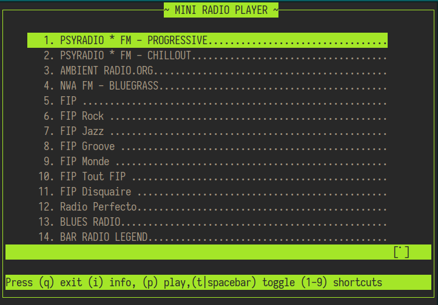

# mini-radio-player
A minimalistic radio player in python3 and curses




```bash
mkdir projects
cd projects/

git clone https://github.com/wdog/mini-radio-player.git
cd mini-radio-player
python3 -m venv venv
source bin/activate
pip3 install -r requirements.txt
./r.py
```

just modify file [radio.json](radio.json) to change radio stations list
