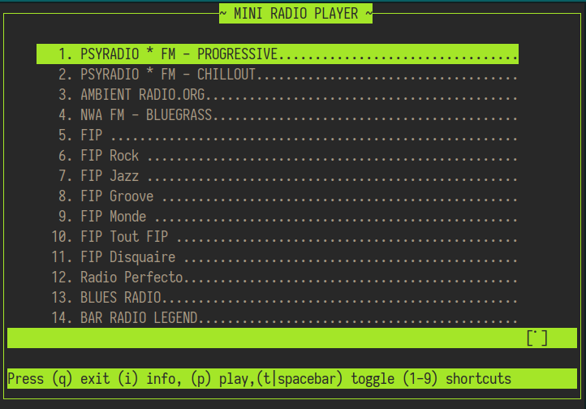

# mini-radio-player
A minimalistic radio player in python3 and curses




```bash
mkdir projects
python3 -m venv projects/venv
cd projects/
git clone https://github.com/wdog/mini-radio-player.git
source venv/bin/activate
pip3 install -r mini-radio-player/requirements.txt
cd mini-radio-player
./r.py
```

just modify file `radio.json` to change radio stations list
